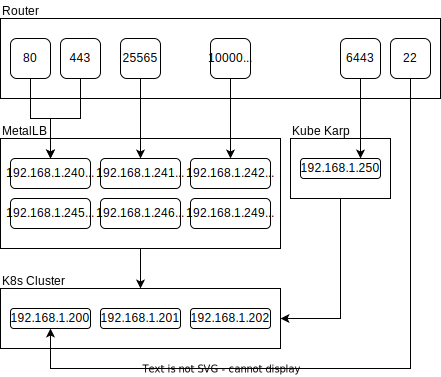

# Home Server

This is the configuration for my home server running in Kubernetes.


[App Dashboard](https://mchill.io)

[Trello Board](https://trello.com/b/XNVnSBvI/home-server)

## Configuration

### Network

All HTTP traffic is routed through Traefik, but TCP and UDP connections are exposed separately. Although additional entrypoints could be configured to proxy these connections, it adds no benefit other than load balancing due to the lack of host or path matching.

HTTPS traffic is secured behind Google forward authentication by default. Some exceptions are made for applications that don't work behind an additional layer of authentication (e.g., Plex and Home Assistant).

Load balancing is acheived using MetalLB for all services running inside of Kubernetes, and Kube Karp for the Kube API server.



### Filesystem

Persistent storage is achieved using NFS and [Longhorn](https://longhorn.io/) volumes.

### Sealed Secrets

[Sealed Secrets](https://github.com/bitnami-labs/sealed-secrets) are stored securely alongside the rest of the server configuration in source control. They are decrypted by a controller running in the cluster.

To create new a sealed secret, follow these steps.

1. Base64 encode the secret value.

    ```bash
    echo -n "secret" | base64 -w 0
    ```

2. Create a native Secret resource with the desired key name and encoded value

    ```yaml
    apiVersion: v1
    kind: Secret
    metadata:
      name: my-secret
      namespace: server
    type: Opaque
    data:
      MY_SECRET_KEY: c2VjcmV0
    ```

3. Use the kubeseal cli tool to generate a Sealed Secret. Be sure to specify the correct namespace, or else the controller won't be able to decrypt the secret.

    ```bash
    kubeseal <secret.yaml >sealed-secret.yaml --controller-namespace=sealed-secrets -o yaml
    ```

## Setup

### Reset Cluster

If the cluster ever needs to be completely reset, this can be easily done with snap.

```bash
sudo snap remove microk8s
sudo snap install microk8s --classic --channel=1.25

# Add custom domain name to cert
sed -i '/^DNS.5 =.*/a DNS.6 = mchill.io' /var/snap/microk8s/current/certs/csr.conf.template
sudo microk8s refresh-certs --cert ca.crt

microk8s status --wait-ready
microk8s config > ~/.kube/config
microk8s enable rbac dns

kubectl label nodes --all --overwrite node.longhorn.io/create-default-disk=config
kubectl annotate nodes --all --overwrite node.longhorn.io/default-disks-config='[{"path":"/mnt/longhorn","allowScheduling":true,"storageReserved":0}]'
```

You'll also have to regenerate all sealed secrets afterwards, since the decryption key will be different in a new cluster.

```bash
find . -type f -iname secret.yaml -not -path "*/charts/*" -execdir sh -c "cat {} | kubeseal --controller-namespace=sealed-secrets -o yaml > sealed-secret.yaml" \;
```

### Deploy

The server is automatically deployed by CI. Manual deployment can be done with the following commands.

```bash
pushd infrastructure && ./apply.sh && popd
pushd applications && ./build.sh | kubectl apply --server-side --force-conflicts -f - && popd
```
